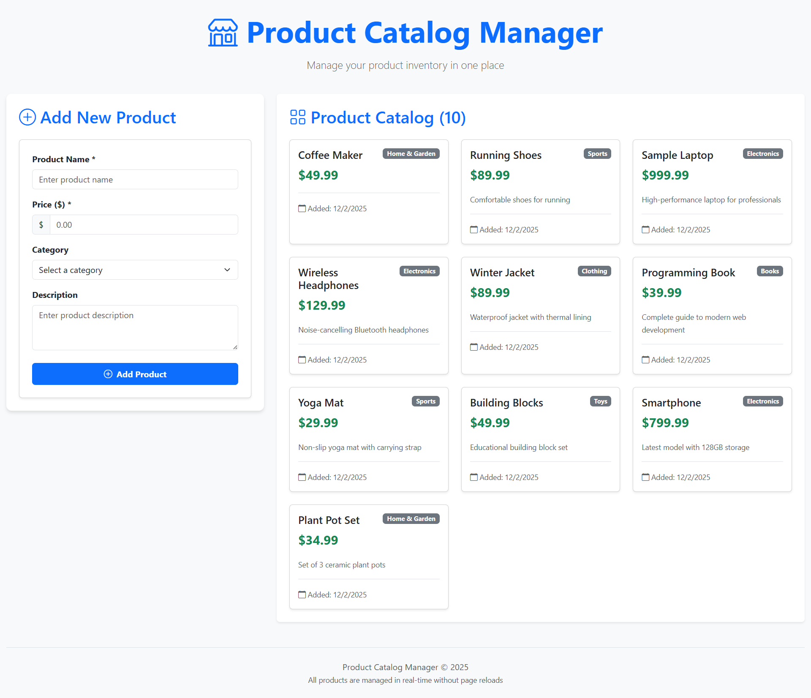
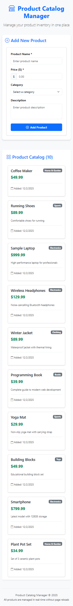

# 🛒 Product Catalog Management System

A full-stack single-page application for managing product catalogs with React frontend and .NET backend. Built as a skill assessment project demonstrating proficiency in full-stack development, database management, and responsive UI design.

## Features

- **✅ Add New Products** - Form with real-time validation
- **✅ View All Products** - Beautiful card layout with sorting
- **✅ Prevent Duplicates** - Database constraint + API validation
- **✅ Responsive Design** - Works on mobile, tablet, desktop
- **✅ Real-time Updates** - No page reloads needed
- **✅ Success/Error Feedback** - Toast notifications for all actions
- **✅ Form Validation** - Both client and server-side validation

## Technology Stack

### Frontend
- **React 19** - Modern functional components with hooks
- **Bootstrap 5** - Responsive CSS framework
- **Bootstrap Icons** - Professional icon set
- **Fetch API** - Modern AJAX calls

### Backend
- **.NET 9 Web API** - Robust RESTful API
- **Entity Framework Core** - ORM for database operations
- **SQL Server (LocalDB)** - Relational database
- **Swagger/OpenAPI** - API documentation

### Database
- **SQL Server LocalDB** - Development database
- **Entity Framework Migrations** - Database versioning
- **Unique Constraints** - Data integrity enforcement

## Prerequisites

- [Node.js 18+](https://nodejs.org/)
- [.NET 9 SDK](https://dotnet.microsoft.com/)
- [SQL Server LocalDB](https://docs.microsoft.com/en-us/sql/database-engine/configure-windows/sql-server-express-localdb) (comes with Visual Studio)
- [Git](https://git-scm.com/)

## Quick Start

### 1. Clone the Repository
git clone https://github.com/yourusername/product-catalog.git
cd product-catalog

### 2. Backend Setup
cd backend/ProductCatalog.API

# Restore packages
dotnet restore

# Build the project
dotnet build

# Run the backend
dotnet run
**Backend runs on:** `http://localhost:5000`  
**Swagger UI:** `http://localhost:5000/swagger`

### 3. Frontend Setup
cd frontend

# Install dependencies
npm install

# Start React development server
npm start
**Frontend runs on:** `http://localhost:3000`

### 4. Database
The database is automatically created and seeded with sample products on first run.

## Database Schema

CREATE TABLE Products (
    Id INT PRIMARY KEY IDENTITY(1,1),
    ProductName NVARCHAR(200) NOT NULL UNIQUE,
    Price DECIMAL(18,2) NOT NULL CHECK (Price > 0),
    Description NVARCHAR(1000),
    Category NVARCHAR(100),
    CreatedAt DATETIME2 NOT NULL DEFAULT GETUTCDATE(),
    UpdatedAt DATETIME2 NULL
);

## 🔧 API Endpoints

| Method | Endpoint | Description |
|--------|----------|-------------|
| `GET` | `/api/products` | Get all products (sorted newest first) |
| `POST` | `/api/products` | Create new product |
| `GET` | `/api/products/check/{name}` | Check if product exists |

### Sample Request

POST /api/products
Content-Type: application/json

{
  "productName": "Wireless Headphones",
  "price": 129.99,
  "description": "Noise-cancelling Bluetooth headphones",
  "category": "Electronics"
}

## Screenshots

Desktop View  
 

Mobile View 
 |

## 🧪 Testing the Application

### Test Scenarios:
1. **Add New Product**
   - Fill form with valid data
   - Click "Add Product"
   - Product appears immediately in list

2. **Duplicate Prevention**
   - Try adding "Sample Laptop" (already exists)
   - Should show "Product with this name already exists"

3. **Form Validation**
   - Submit empty form → Shows required field errors
   - Enter invalid price (e.g., -10) → Shows validation error
   - Enter price with 3 decimals → Shows decimal place error

4. **Responsive Design**
   - Resize browser to mobile width
   - Form and product cards should adjust automatically

## Project Structure

product-catalog/
├── frontend/                    # React Application
│   ├── public/
│   │   └── index.html
│   ├── src/
│   │   ├── components/         # React Components
│   │   │   ├── ProductForm.js
│   │   │   ├── ProductList.js
│   │   │   ├── Notification.js
│   │   │   └── ErrorBoundary.js
│   │   ├── services/          # API Services
│   │   │   └── api.js
│   │   ├── App.js            # Main App Component
│   │   ├── index.js          # Entry Point
│   │   └── styles.css        # Custom Styles
│   └── package.json
│
├── backend/                    # .NET Web API
│   └── ProductCatalog.API/
│       ├── Controllers/       # API Controllers
│       │   └── ProductsController.cs
│       ├── Data/             # Database Context
│       │   └── ApplicationDbContext.cs
│       ├── DTOs/             # Data Transfer Objects
│       │   ├── CreateProductDto.cs
│       │   └── ProductDto.cs
│       ├── Models/           # Entity Models
│       │   └── Product.cs
│       ├── Services/         # Business Logic
│       │   ├── IProductService.cs
│       │   └── ProductService.cs
│       ├── Program.cs        # Startup Configuration
│       ├── appsettings.json  # Configuration
│       └── ProductCatalog.API.csproj
│
├── screenshots/              # Application Screenshots
├── .gitignore               # Git Ignore Rules
└── README.md               # This File

## Security Features

- **Input Validation** - Both client and server-side
- **SQL Injection Prevention** - Entity Framework parameterized queries
- **XSS Protection** - HTML tag removal in sanitization
- **CORS Configuration** - Only allows trusted origins
- **Error Message Sanitization** - No sensitive data exposure

## Sample Data

The database is seeded with 10 sample products:
- Electronics: Sample Laptop, Wireless Headphones, Smartphone
- Clothing: Winter Jacket
- Books: Programming Book
- Sports: Running Shoes, Yoga Mat
- Home & Garden: Coffee Maker, Plant Pot Set
- Toys: Building Blocks

## Author: 
Tharushika Rukshani